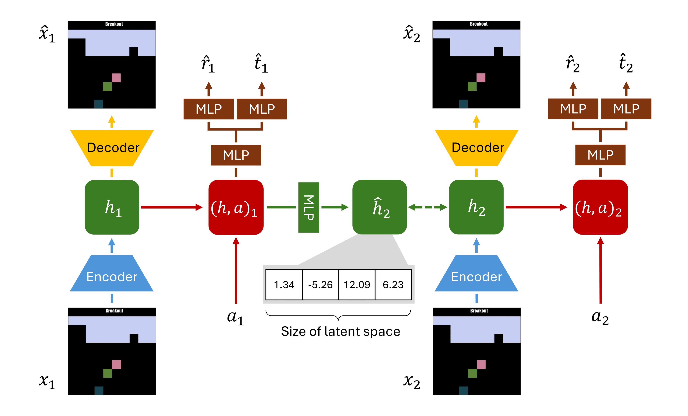
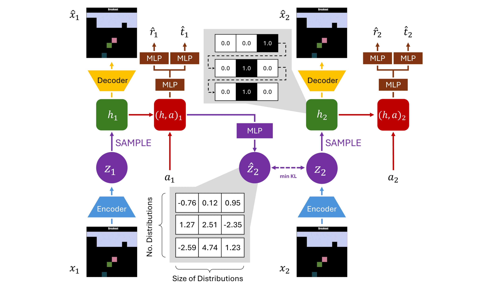
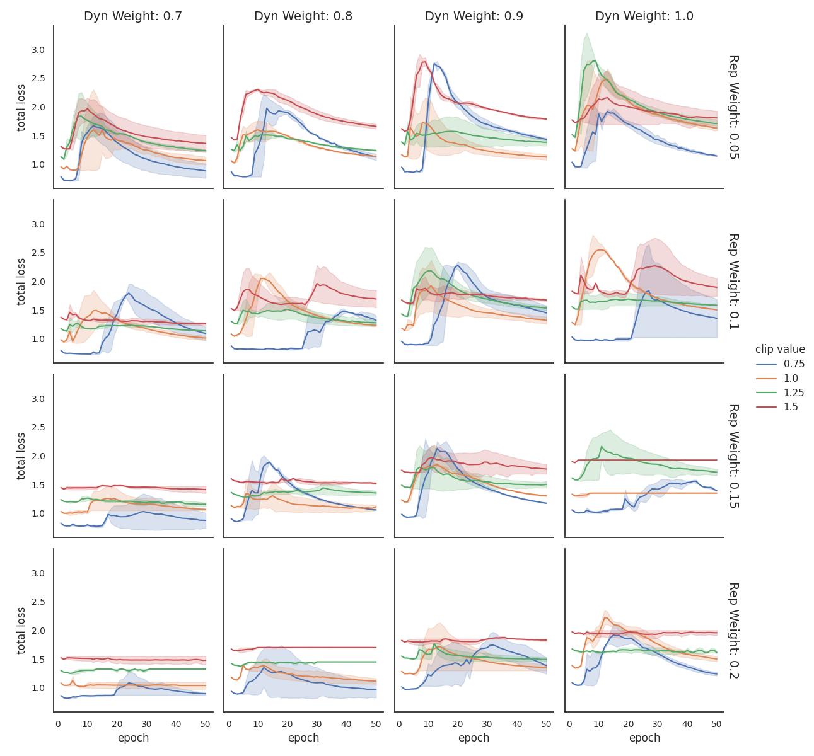
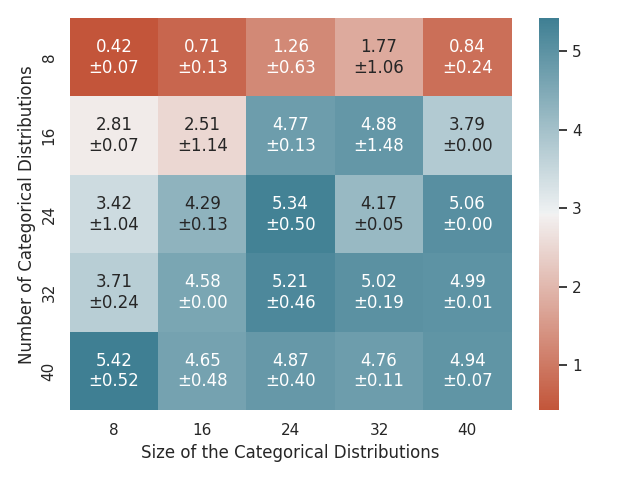

# Understanding the Effects of Discrete Representations in Model-Based Reinforcement Learning

**Author**: Mihai Mitrea

**Supervisors**: Frans A. Oliehoek and [Jinke He](https://github.com/JINKEHE)

[Link to Paper](https://repository.tudelft.nl/record/uuid:8852479d-8a45-4305-b6ee-be01f6c54dd4)

## Abstract

While model-free reinforcement learning (MFRL) approaches have been shown effective at solving a diverse range of environments, recent developments in model-based reinforcement learning (MBRL) have shown that it is possible to leverage its increased sample efficiency and generalisation abilities to solve highly complex tasks with fewer resources and environment interactions. The introduction of discrete latent states through categorical distributions allowed DreamerV2, a MBRL approach, to surpass the state-of-the-art MFRL Rainbow algorithm on the Arcade Learning Environment. Despite the successes of this approach, it is not yet understood why discretization improves performance. This paper investigates how the discretization of the latent space through categorical distribution affects planning performance in a deterministic environment. Further investigations are conducted on the model's generalization abilities and the impact of the latent space's shape on performance. By using a dataset of experiences instead of directly interacting with the environment, the models are trained in an offline setting. Results show that the discrete world model underperforms compared to a continuous latent space model while being significantly harder to train. Further investigations concluded that the number of categorical distributions has a high influence on performance and that in the considered setting the discrete world model can generalize better than the continuous baseline but it does so by sacrificing small gains in important metrics.

## Overview

The files inside the [cluster](cluster) directory were used to submit jobs to TU Delft's cluster, while the contents of [plotting](plotting) are my result analysis tools.

The architecture of the Neural Networks can be found in the [nets.py](nets.py) file and the training proccess is in the [learn_model.py](learn_model.py) file.

## Model Architecture

The architecture as a whole is heavily influenced by that of the [DreamerV2](https://arxiv.org/abs/2010.02193) and [DreamerV3](https://arxiv.org/abs/2301.04104) models. featuring prediction in latent space without the need for reconstruction. The most significant change is the replacement of the Dreamer's RSSM with a simple dynamics model suited for the fully observable setting.

The world model is structured into three components. The representation component encodes the input frame $x_i$ into its latent space representation $h_i$. The reconstruction network uses this embedding to decode the latent state into an approximate frame $\hat{x}_i$ which resembles, as closely as possible, the original input. Both components are implemented as Convolutional Neural Networks (CNN)  with the representation model also using a Multi-Layer Perceptron (MLP). The dynamics component, consisting of multiple MLPs, uses an action $a_i$ and the latent embedding $h_i$ to predict the reward $r_i$, termination $t_i$, and latent state of the transition's next frame $\hat{h}_{i+1}$. All model components and their relations are presented in \autoref{fig:architecture}. 

## Loss Function

The world model and its components are optimized using the loss function shown in Equation 1
with the Adam optimizer [ 24 ]. The function’s three components ensure the model learns
meaningful latent representations while enabling transitions through the dynamics model.
To deal with the inability of backpropagating gradients through samples obtained from a
categorical distribution, the discrete model is trained using the Gumber-Softmax Estimator with constant temperature τ = 1. This distribution estimates the categorical distribution
while also one-hot encoding samples.

$$
\mathcal{L}(\phi) = 
\mathcal{L}_{pred}(\phi) + \beta_{dyn}\mathcal{L}_{dyn}(\phi) + \beta_{rep}\mathcal{L}_{rep}(\phi)
$$

$$ with $$

$$
\mathcal{L}_{pred}(\phi) = \text{MSE}(\hat{x_i}, x_i) + \text{MSE}(\hat{r_i}, r_i) + \text{BCE}(\hat{t_i}, t_i)
$$

$$
\mathcal{L}_{dyn}(\phi) = 
\begin{cases}
     \text{MSE}(\text{sg}(\hat{l_i}), l_i) & \text{, continuous latent space} \\
     \max(kl\_clip, \text{KL}(\text{sg}(\hat{z_i}), z_i)) & \text{, discrete latent space} \\
\end{cases}
$$

$$
\mathcal{L}_{rep}(\phi) = 
\begin{cases}
     \text{MSE}(\hat{l_i}, \text{sg}(l_i)) & \text{, continuous latent space} \\
     \max(kl\_clip, \text{KL}(\hat{z_i}, \text{sg}(z_i))) & \text{, discrete latent space} \\
\end{cases}
$$

### Continuous Model

The representation and dynamics models directly learn the continuous latent representations $h_i$ and $\hat{h}_{i+1}$.

    

### Discrete Model

The representation and dynamics models learn the log probabilities of multiple categorical distributions in the form of $z_i$ and $\hat{z}_{i+1}$. The latent embedding $h_i$ is obtained by sampling all the distributions in $z_i$ and one-hot encoding the results.

    

## Findings

Results show that the discrete world model underperforms compared to a continuous latent space model while being significantly harder to train. Further investigations concluded that the number of categorical distributions has a high influence on performance and that in the considered setting the discrete world model can generalize better than the continuous baseline but it does so by sacrificing small gains in important metrics.

### Training Instabilities

The behavior of the discrete model could represent its tendency to minimize the dynamics
and representation losses at the expense of its ability to predict rewards and episode
terminations. Breaking down the loss function into its components, it has been observed that
these sudden spikes are mainly influenced by increases in the dynamics and representation
losses, signaling a transition between simple and easy to predict embeddings towards more
detailed ones.

    

### Embedding Dimension and Performance

Results show that the number of categorical distributions is much more important
to the model’s performance than their size. However, when considering a small number of
distributions, larger sizes can somewhat improve performance, although not to the same
degree.

    

